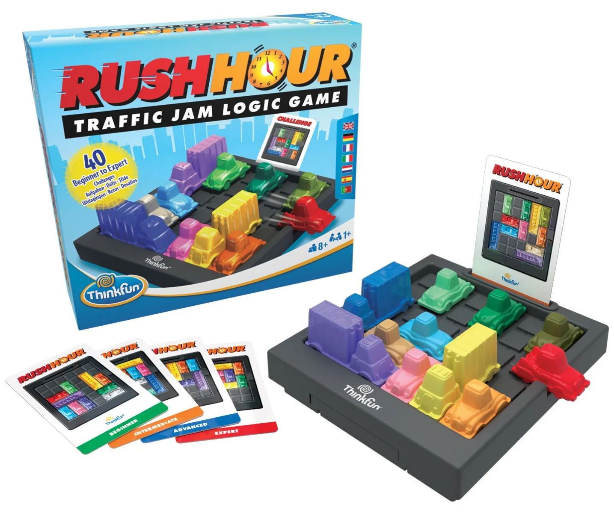

# Rush Hour Game

Welcome to the Rush Hour game! 
In this classic puzzle game, your goal is to move cars on the game board to clear a path for the red car to exit the grid. 
The game challenges your logical thinking and strategic planning.




## Table of Contents

- [Game Description](#game-description)
- [Getting Started](#getting-started)
- [Car Class](#car-class)
- [Board Class](#board-class)
- [Game Class](#game-class)
- [Running the Game](#running-the-game)
- [License](#license)
- [Author](#author)

## Game Description

This Rush Hour game is a digital adaptation of the classic sliding block puzzle. 
You'll be presented with a game board containing cars of various sizes, orientations, and colors. 
The challenge is to slide the cars horizontally or vertically to create an unobstructed path for the red car to exit the grid.


## Getting Started

To play the Rush Hour game on your local machine, follow these steps:

1. Clone this repository using the command: `git clone https://github.com/Orin111/rush-hour`
2. Navigate to the project directory: `cd rush-hour-game`
3. Create a virtual environment (optional but recommended): `python3 -m venv venv`
4. Activate the virtual environment: `source venv/bin/activate`
5. Install required libraries: `pip install -r requirements.txt`
6. Run the game: `python3 game.py car_config.json`

## Car Class

The `Car` class represents a car on the game board. Each car has attributes such as its name, length, location, and orientation. You can create, move, and manipulate cars using this class.

Here's an overview of the methods available in the `Car` class:

- `__init__(self, name, length, location, orientation)`: Initializes a new car object with specified attributes.
- `get_length(self)`: Returns the length of the car.
- `get_orientation(self)`: Returns the orientation of the car (0 for vertical, 1 for horizontal).
- `car_coordinates(self)`: Returns a list of coordinates that the car occupies on the board.
- `possible_moves(self)`: Returns a dictionary of possible movements permitted by this car.
- `movement_requirements(self, movekey)`: Returns a list of cell locations that must be empty for a move to be legal.
- `move(self, movekey)`: Moves the car in a specified direction.
- `get_name(self)`: Returns the name of the car.

## Board Class

The `Board` class represents the game board itself. It provides methods to create the board, add cars, check for legal moves, and more. 
The interaction with the `Board` class is crucial for playing the Rush Hour game.

Here's an overview of the methods available in the `Board` class:

- __init__(self): Initializes a new instance of the Board class.
- get_graphic(self): Returns the graphical representation of the game board.
- create_board(self, BOARD_SIZE): Creates the initial graphical representation of the game board.
- get_cars(self): Returns a dictionary of cars on the board.
- __str__(self): Returns a string representation of the current status of the board.
- cell_list(self): Returns a list of coordinates of cells on the board.
- in_board(self, c1): Checks if a given coordinate is within the boundaries of the game board.
- possible_moves(self): Returns a list of possible moves that can be made on the current board configuration.
- check_cars(self): Returns a list of empty cell locations on the board.
- target_location(self): Returns the coordinates of the exit cell on the board.
- cell_content(self, coordinate): Checks if a given cell is occupied by a car.
- add_car(self, car): Adds a car to the game board.
- move_car(self, name, movekey): Moves a car one step in a given direction.


## Game Class

The `Game` class orchestrates the Rush Hour game by managing player turns, processing inputs, and checking for game completion. It utilizes the `Board` class and the `Car` class to create a functional and interactive game experience.

Here's an overview of the methods available in the `Game` class:

- `__init__(self, board)`: Initializes a new game instance with a specified game board.
- `__single_turn(self)`: Executes a single turn of the game, processing user input and checking for game continuation.
- `play(self)`: The main driver of the game, manages the game until completion.

### Usage Examples

To create a new game instance, you can use the following code:

```python
game_board = Board()  # Create a board object using the Board class
game = Game(game_board)  # Create a game object using the Game class

To play the game, call the play method on the game object:
game.play()

The game will prompt you to input car colors and movement directions. Enter ! to end the game whenever you wish.


## Running the Game

To play the Rush Hour game, follow these steps after setting up the project:

1. Run the game script: `python3 game.py car_config.json`
2. Follow the prompts to input car color and movement direction.
3. Try to move the cars strategically to create a path for the red car to exit.
4. Enter `!` to end the game whenever you want.

## License

This project is licensed under the MIT License. Feel free to use, modify, and distribute it according to the terms of the license.

## Author

This README was written by Orin Pour.

---

Feel free to explore the provided code, adapt it to your needs, and have fun playing and solving puzzles in the Rush Hour game! If you have any questions about the project, code, or usage, don't hesitate to ask.
